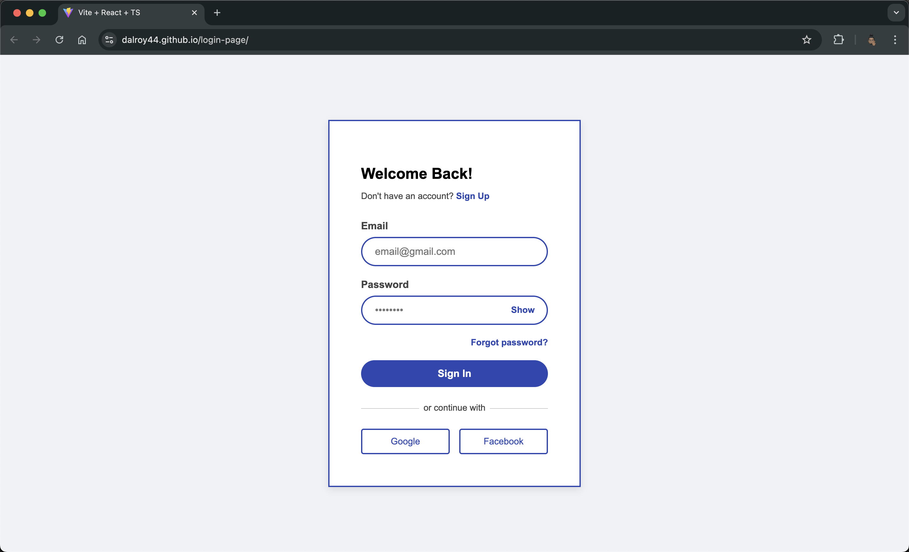
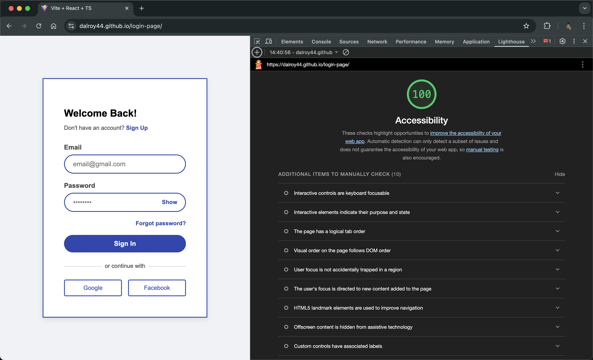

# Login Page Application

This project is a responsive login page built with React and TypeScript, featuring form validation and a clean user interface. It was developed as a solution to the FE Dev Test Requirements.

**Live Demo:** [https://dalroy44.github.io/login-page/](https://dalroy44.github.io/login-page/)

## Features

* **User Authentication Form:**
    * Username (Email) and Password fields.
    * Client-side validation for email format and password length (minimum 8 characters).
    * Error messages displayed for invalid input.
* **Password Visibility Toggle:** "Show/Hide" option for the password field.
* **Submission Handling:**
    * "Sign In" button is disabled until both fields have valid input.
    * Simulated API call with a 2-second loader on submission.
    * Displays "Sign In Successful" or "Sign In Failed" messages.
* **Responsive Design:** The layout adapts to different screen sizes.
* **Accessibility:** Implemented with accessibility considerations, including ARIA attributes where appropriate and addressing Lighthouse report feedback.
* **Additional UI Elements:**
    * "Forgot password?" link.
    * "or continue with" social login section.
    * Placeholder "Google" and "Facebook" social login buttons.

## Technologies Used

* **React:** For building the user interface.
* **TypeScript:** For static typing and improved code quality.
* **Vite:** As the build tool and development server.
* **CSS:** Custom CSS with theme variables (custom properties) for styling.
* **HTML**
* **Git & GitHub:** For version control.
* **GitHub Pages:** For deployment.

## Project Setup and Running Locally

1.  **Clone the repository:**
    ```bash
    git clone https://github.com/dalroy44/login-page.git
    cd login-page
    ```
2.  **Install dependencies:**
    ```bash
    npm install
    ```
3.  **Run the development server:**
    ```bash
    npm run dev
    ```
    The application will typically be available at `http://localhost:5173`.

4.  **Build for production:**
    ```bash
    npm run build
    ```
    This will create a `dist` folder with the optimized static assets.

## Screenshots

### Final Output

Here's a look at the login page:

  ### Lighthouse Accessibility Report

The project aims for high accessibility standards.

 *

## Deployment

This application is deployed using GitHub Pages. The deployment workflow is configured in `.github/workflows/deploy.yml` and triggers automatically on pushes to the `main` branch.